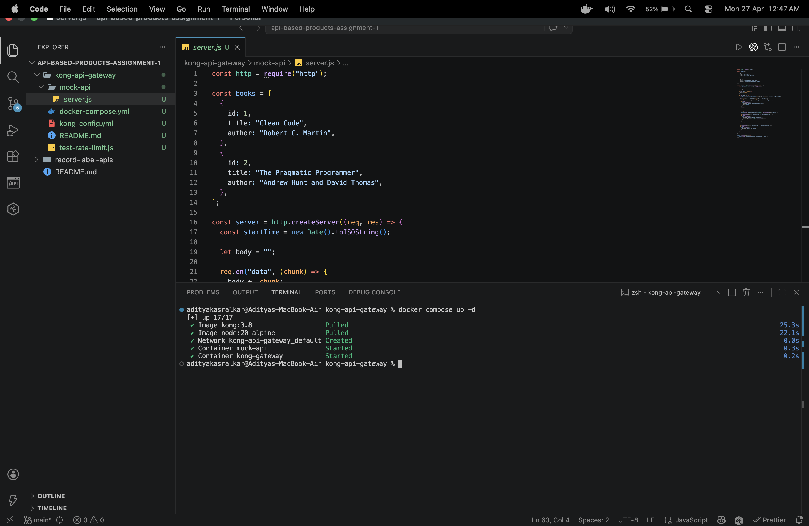
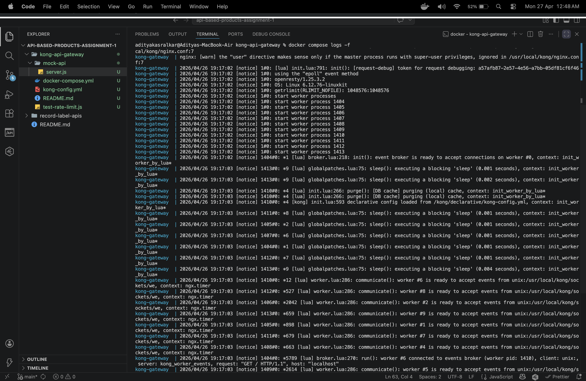
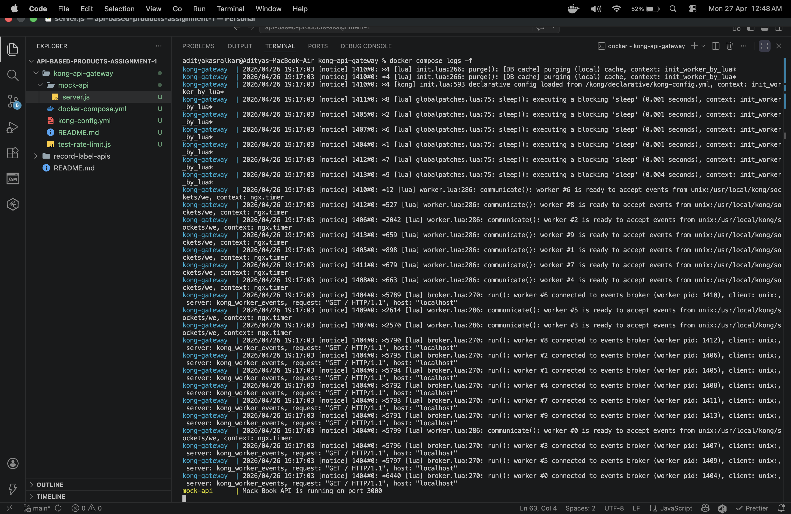
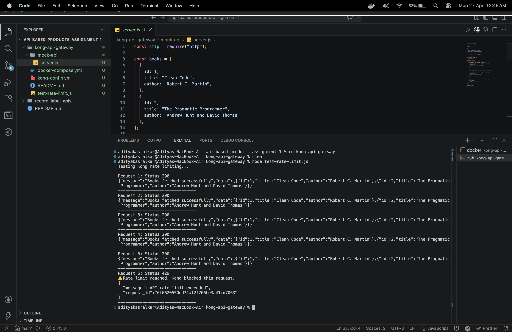
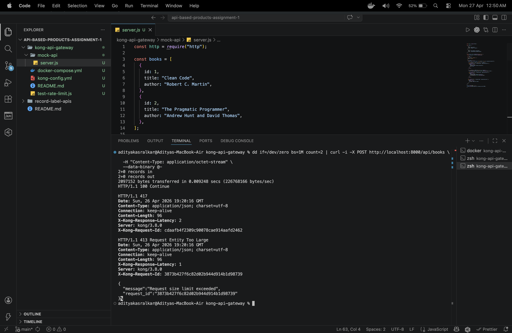

# Question 2: Kong API Gateway

This folder demonstrates **rate limiting** and **request size limiting** using Kong API Gateway.

A small mock Book API is used as the backend service. Kong receives the request first, applies the limits, and then forwards valid requests to the backend.

---

## Limits Used

```txt
Rate limit: 5 requests per minute
Request size limit: 1 MB
```

---

## Folder Structure

```txt
kong-api-gateway/
│
├── README.md
├── kong-config.yml
├── docker-compose.yml
├── mock-api/
│   └── server.js
├── images/
│   ├── 1-docker-up.png
│   ├── 2-kong-logs.png
│   ├── 3-mock-api-running.png
│   ├── 4-rate-limit-test.png
│   └── 5-request-size-test.png
└── test-rate-limit.js
```

---

## Request Flow

```txt
Client → Kong API Gateway → Mock API
```

Client calls:

```txt
http://localhost:8000/api/books
```

Kong forwards only valid requests to the backend mock API.

---

## Kong Plugins Used

### 1. Rate Limiting

```yaml
minute: 5
policy: local
limit_by: ip
```

This allows only **5 requests per minute** from one IP.

If the limit is exceeded, Kong returns:

```http
429 Too Many Requests
```

---

### 2. Request Size Limiting

```yaml
allowed_payload_size: 1
```

This allows request body size up to **1 MB**.

If the payload is larger than 1 MB, Kong returns:

```http
413 Payload Too Large
```

---

## Run the Setup

```bash
cd kong-api-gateway
docker compose up -d
```

Check containers:

```bash
docker ps
```

View logs:

```bash
docker compose logs -f
```

---

## Test Normal Request

```bash
curl -i http://localhost:8000/api/books
```

Expected:

```http
HTTP/1.1 200 OK
```

---

## Test Rate Limiting

```bash
node test-rate-limit.js
```

Expected:

```txt
Request 1: Status 200
Request 2: Status 200
Request 3: Status 200
Request 4: Status 200
Request 5: Status 200
Request 6: Status 429
Rate limit reached. Kong blocked this request.
```

---

## Test Request Size Limiting

### Mac/Linux

```bash
dd if=/dev/zero bs=1M count=2 | curl -i -X POST http://localhost:8000/api/books \
  -H "Content-Type: application/octet-stream" \
  --data-binary @-
```

Expected:

```http
HTTP/1.1 413 Payload Too Large
```

---

### Windows PowerShell

```powershell
$body = "a" * 2097152
Invoke-WebRequest -Uri "http://localhost:8000/api/books" -Method POST -Body $body -ContentType "text/plain"
```

Expected:

```txt
413 Payload Too Large
```

---

## Execution Screenshots

### 1. Starting Kong and Mock API



---

### 2. Kong Gateway Logs



---

### 3. Mock API Running



---

### 4. Rate Limiting Test

- First 5 requests → 200 OK  
- 6th request → 429 Too Many Requests  



---

### 5. Request Size Limiting Test

- Request blocked with **413 Payload Too Large**



---

## Summary

This implementation shows how Kong API Gateway can protect backend APIs using:

- Rate limiting (to control request frequency)
- Request size limiting (to prevent large payloads)

### Expected Status Codes

| Scenario | Status Code |
|---|---|
| Normal request | 200 OK |
| Rate limit exceeded | 429 |
| Payload too large | 413 |